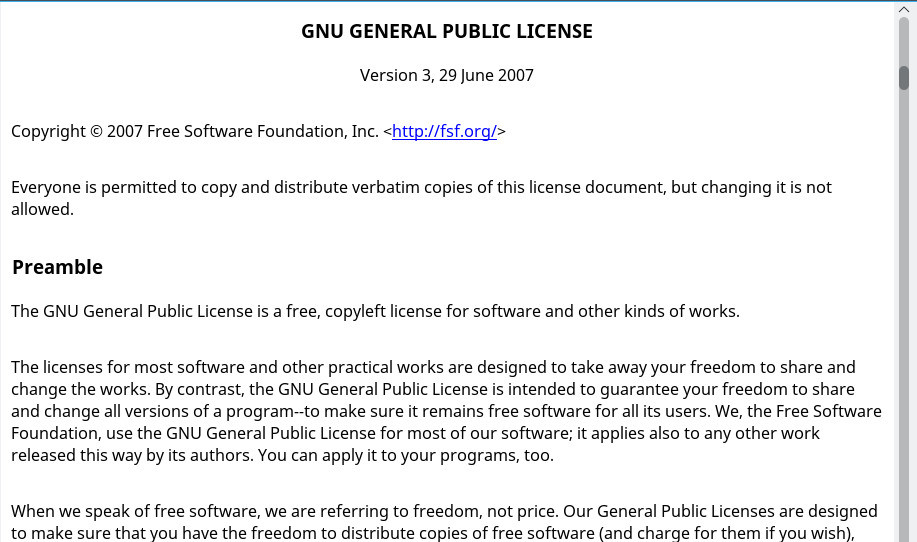

# TSimpleWebViewer

Is a [Lazarus](http://www.lazarus-ide.org/) component. It can display simple webpages.
It is derived from TIpHtmlPanel and needs the unit IpHtml. 

## Usage
```
SimpleWebViewerHelp.LoadFromString(html_as_a_string);
```

## Screenshot 
Here I loaded the GPL into the SimpleWebViewer

